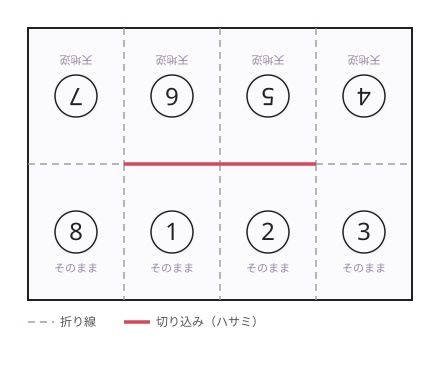
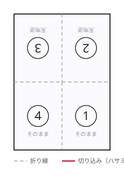
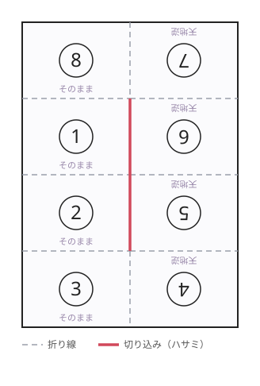

# A7 折本プリンター

**Windows 用の仮想プリンタ（中間ドライバー）です。**
どんなアプリからでも「印刷 → A7 折本プリンター」を選ぶだけで、
[キンコーズ・ジャパン「手軽に作れる折本の作り方」](https://www.kinkos.co.jp/column/folding-book/)
の図6 と同じ面付けに並べ替えた PDF ができ、そのまま実際のプリンタへ流せます。

A4 用紙 1 枚・**片面印刷だけ**で、A7（74×105mm）8 ページの小冊子が作れます。



---

## しくみ

```
  ┌──────────┐   印刷    ┌──────────────┐  PDF   ┌──────────────┐
  │ Word / PDF │ ───────▶ │ A7 折本プリンター │ ─────▶ │ スプールフォルダ │
  │ ブラウザ 等 │          │ (Print to PDF +  │        │  job.pdf        │
  └──────────┘          │  ローカルポート)  │        └───────┬──────┘
                          └──────────────┘                │ 監視
                                                            ▼
  ┌──────────┐  印刷/表示 ┌──────────────┐  面付け  ┌──────────────┐
  │ 実プリンタ  │ ◀─────── │ 折本 PDF        │ ◀────── │ orihon watch   │
  └──────────┘            └──────────────┘          └──────────────┘
```

Windows の署名付きカーネルドライバーを書く必要はありません。
標準の **「Microsoft Print to PDF」ドライバー**を、ファイルを指す
**ローカルポート**に紐づけた仮想プリンタを作り、そこへ落ちてきた PDF を
常駐プロセスが拾って面付けし直す、という構成です。
保存ダイアログは出ないので、ユーザーから見れば「折本で刷れるプリンタ」が
1 つ増えたように見えます。

---

## インストール

### 必要なもの

| | |
|---|---|
| OS | Windows 10 / 11（「Microsoft Print to PDF」が使えること） |
| Python | 3.10 以上 |
| ライブラリ | `pymupdf`、`pywin32`（インストーラが自動で入れます） |
| 実プリンタへ自動送出したい場合 | [SumatraPDF](https://www.sumatrapdfreader.org/) または Ghostscript（任意） |

### かんたん（推奨）

PowerShell を開いて、これ 1 行です。clone もダウンロードも要りません。

```powershell
irm https://github.com/kiwiman0706-beep/a7leafletprinter/releases/latest/download/bootstrap.ps1 | iex
```

最新リリースを取ってきて `C:\ProgramData\OrihonPrinter\app` に展開し、
インストーラを実行します（UAC が出るので「はい」を選んでください）。
**同じコマンドを後から実行すれば上書き更新**になります（設定・ログはそのまま）。

バージョンを指定したい場合:

```powershell
$b = "$env:TEMP\bootstrap.ps1"
irm https://github.com/kiwiman0706-beep/a7leafletprinter/releases/latest/download/bootstrap.ps1 -OutFile $b
& $b -Version v0.1.0
```

### 手動で入れる

1. [リリースページ](https://github.com/kiwiman0706-beep/a7leafletprinter/releases)から
   `orihon-printer-x.y.z.zip` をダウンロードして展開します（`git clone` でも可）。
2. `installer\install.cmd` をダブルクリックします。
   UAC が出るので「はい」を選んでください（プリンタとポートの追加に管理者権限が要ります）。
3. 最後に環境チェックが走り、`[OK]` が並べば完了です。

```powershell
# 手動で実行する場合
powershell -ExecutionPolicy Bypass -File .\installer\Install-OrihonPrinter.ps1

# オプション例：プリンタ名と既定用紙を変える
.\installer\Install-OrihonPrinter.ps1 -PrinterName "折本プリンター" -DefaultPaper A4
```

インストーラがやること:

- `C:\ProgramData\OrihonPrinter\` 以下にスプール・ログ・設定フォルダを作る
- ローカルポート `…\spool\job.pdf` を作る
- そのポートに「Microsoft Print to PDF」を紐づけた仮想プリンタを作る
- 仮想プリンタの既定用紙を **A7** にする（`-DefaultPaper` で変更可）
- `pymupdf` / `pywin32` を pip で入れる
- 監視プロセスをログオン時に自動起動するタスク **OrihonPrinter Watcher** を登録する

### アンインストール

```powershell
.\installer\uninstall.cmd            # 設定とログは残す
# または
.\installer\Uninstall-OrihonPrinter.ps1 -RemoveData   # きれいに全部消す
```

---

## 使い方

1. 好きなアプリで原稿を開き、**印刷 → プリンタに「A7 折本プリンター」** を選びます。
   * 用紙は **A7** のまま印刷するのがいちばんきれいです（文字が縮みません）。
     A7 を選べないアプリなら A4 のままでも構いません（自動で縮小配置します）。
   * ページ数は **8 の倍数**にすると無駄がありません。足りない分は白紙になります。
2. 面付けされた PDF が `ドキュメント\OrihonPrinter\` にでき、
   **そのまま開いて印刷ダイアログが出ます**。送り先のプリンタ・部数・両面などは
   ここで選んでください（`output_mode` で挙動は変えられます）。
3. **A4・片面・等倍（100%／「用紙に合わせる」ではない）** で印刷します。
4. [折り方](#折り方)のとおりに折れば折本の完成です。

設定を変えるには:

```
C:\ProgramData\OrihonPrinter\設定を開く.cmd
```



---

## 折り方

図6 の面付けは 8 マス（4 列 × 2 段）です。**赤い線＝ハサミを入れる場所**、
**破線＝折り線**で、どちらもレイアウト定義から自動的に導かれます。

1. 印刷した面を上にして置きます。
2. 用紙を **横半分**（上下の境目）に折って、しっかり折り目を付けてから開きます。
3. 同じように**縦に 4 等分**の折り目を付けて、開きます。
4. **中央 2 マス分の横線**（印刷された赤い線）にハサミを入れます。
   端までは切らず、中央の 2 マス分だけです。
5. もう一度用紙を横半分に折ると、切り込みが開いて穴になります。
6. 左右の端を中央に向かって押し込むと、切り込みが十字に開きます。
7. 表紙（①）が外側に来るようにたたんで、折り目を整えれば完成です。

> **なぜこの並びなのか**
> 折本は「1 枚の紙の片面だけ」で本にするので、ページ①→②→…→⑧→① が
> マスの上を一筆書きでぐるりと一周している必要があります。
> このとき、左右に隣り合うマスは向きが同じ、上下に隣り合うマスは向きが 180 度逆になります。
> 一周のつながりに使われない境界＝どこにも折れない線が「切り込み」です。
> 詳しくは [docs/layout.md](docs/layout.md) を参照してください。

---

## 設定

`C:\ProgramData\OrihonPrinter\config.json` に保存されます。
設定画面（`orihon gui`）か、コマンドラインから変更できます。

| キー | 既定値 | 説明 |
|---|---|---|
| `layout` | `orihon8` | 面付けレイアウト（後述） |
| `paper` | `A4` | 出力用紙。`B5` や `210x297` のような直接指定も可 |
| `orientation` | `auto` | 用紙の向き。`auto` は原稿の縦横比から自動判定 |
| `safe_margin_mm` | `4.0` | 各パネル内側の余白。プリンタの印字できないフチよけ |
| `guides` | `cut` | `none` / `cut`（切り込みのみ）/ `fold`（折り線のみ）/ `full`（図6 と同じ） |
| `fit` | `contain` | `contain`=縦横比を保つ / `stretch`=パネルいっぱいに伸ばす |
| `fill` | `blank` | ページが足りないとき `blank`=白紙 / `repeat`=先頭から繰り返す |
| `max_sheets` | `0` | 出力する用紙の最大枚数（0 で無制限） |
| `auto_rotate` | `true` | 原稿とパネルの向きが食い違うとき、パネル内で 90 度回して余白を減らす |
| `trim` | `false` | 原稿の周囲にある単色の帯（用紙に合わせて印刷したときの余白）を切り落とす |
| `output_mode` | `dialog` | `dialog`=開いて印刷ダイアログを出す / `open`=ビューアで開くだけ / `print`=確認なしで送る / `save`=保存だけ |
| `target_printer` | `""` | `print`・`dialog` のときの送り先。空なら通常使うプリンタ |
| `output_dir` | `ドキュメント\OrihonPrinter` | 出力先フォルダ |
| `filename_template` | `{title}_{layout}_{timestamp}.pdf` | `{title}` `{stem}` `{layout}` `{timestamp}` `{date}` `{time}` が使えます |
| `keep_source` | `false` | 面付け前の元 PDF も残す |
| `settle_sec` | `1.5` | この秒数だけ更新が止まったら「書き込み完了」とみなす |
| `keep_processed_days` | `3` | 処理済みファイルを残す日数 |

`{title}` は PDF のタイトル情報から取ります。Microsoft Print to PDF は
印刷元アプリのドキュメント名をここに入れるので、
「どの原稿から作った折本か」がファイル名で分かります。

---

## レイアウト一覧

`orihon layouts -v` で面付け図つきの一覧が出ます。

| 名前 | 別名 | 内容 |
|---|---|---|
| `orihon8` | `a7`, `8p` | **既定。** A4→A7 8 ページ・左綴じ（図6 と同じ） |
| `orihon8-right` | `a7-right` | 同 8 ページの右綴じ（縦書き・マンガ向け） |
| `orihon8-landscape` | `slide`, `a7-yoko` | **横長原稿用。** A4縦→A7横 8 ページ・天綴じ。スライドがそのまま入る |
| `orihon8-landscape-bottom` | `slide8-rev` | 同 8 ページを下にめくる版 |
| `orihon4` | `a6`, `4p` | A4→A6 4 ページ。切り込み不要 |
| `orihon4-right` | `4p-right` | 同 4 ページの右綴じ |
| `orihon4-landscape` | `slide4`, `a6-yoko` | A4横→A6横 4 ページ・天綴じ。切り込み不要 |
| `accordion8` | `jabara8` | 蛇腹（経本）折り 8 コマ。上下 2 本に切って貼り合わせる |
| `accordion4` | `jabara4` | 蛇腹折り 4 コマ。切り離し不要 |
| `nup8` | `8up` | 折らずに切り離すだけの A7 8 面付け（チラシ・カード向け） |
| `nup4` / `nup2` | `4up` / `2up` | 同 A6 4 面 / A5 2 面 |

同じ A7 チラシを 8 枚刷りたいときは:

```
orihon impose チラシ.pdf --layout nup8 --fill repeat -o 8面付け.pdf
```

---

## 横長の原稿（パワーポイントのスライド・A4 横）

スライドのような横長のページを、既定の `orihon8` にそのまま流すと
**紙の 4 割しか使えません**（縦長のパネルに横長の絵を収めるため、上下が大きく空く）。
これを避ける方法が 2 つあります。

### おすすめ：横長パネルのレイアウトを使う

```
orihon impose スライド.pdf --layout orihon8-landscape
```



`orihon8-landscape` は **`orihon8` の紙を 90 度倒しただけ**のものです。
折り方も切り込みの位置もまったく同じで、向きが 90 度回るだけ。
A4 を**縦**に置いて 2 列 4 段に分けるので、パネルが **105×74mm の横長**になり、
スライドがほぼそのまま収まります。仕上がりは**上にめくる天綴じ**の小冊子です。

用紙の使用率の実測値（`safe_margin_mm=4` のとき。括弧内は自動回転が働いた場合）:

| 原稿 | `orihon8`（縦長パネル） | `orihon8-landscape`（横長パネル） |
|---|---|---|
| 16:9 スライド | 38% （回転すれば 82%） | **82%** |
| 4:3 スライド | 51% （回転すれば 91%） | **91%** |
| A4 横 / A7 横 | 48% （回転すれば 97%） | **97%** |
| A4 縦 / A7 縦 | **97%** | 48% （回転すれば 97%） |

100% にならないのはパネル内側の余白（既定 4mm）のぶんです。
`--margin 0` にすれば A4 横は 100%、16:9 は 80% になります。

### もう一つ：そのまま回してしまう（既定で有効）

`auto_rotate`（既定 `true`）が効いていると、原稿とパネルの向きが食い違うときに
**パネルの中で 90 度回して**余白を減らします。上の表の「自動回転」がこれです。
面積の無駄は同じくらい減りますが、読むときに冊子ごと横に倒す必要があります。

自動回転が働くと、その旨と「`--layout orihon8-landscape` を使うと回さずに済みます」
という案内が出ます。回したくない場合は `--no-auto-rotate` を付けてください。

### 注意：仮想プリンタ経由だとスライドに白帯が付くことがあります

PowerPoint から**仮想プリンタに印刷**すると、PowerPoint はスライドを
プリンタの用紙（既定では A7 縦）に合わせて描くため、**上下に大きな白帯が付いた
A7 縦のページ**として届きます。この状態だと折本側は「ページいっぱいに配置できた」と
判断してしまい、実際にはスライドが小さいまま、ということが起こります。

対処は 3 つあります。上ほどきれいです。

1. **PowerPoint から PDF で書き出す**（ファイル → エクスポート → PDF）。
   スライドの形そのままの PDF になるので、`orihon impose スライド.pdf --layout orihon8-landscape` で完璧に収まります。
2. **仮想プリンタの用紙を横長にする。** プリンタのプロパティで用紙を A4 などにし、
   印刷の向きを「横」にしてから印刷してください。
3. **`--trim` で白帯を切り落とす。** 原稿の周囲にある「全幅が単色の帯」を検出して
   取り除きます。`orihon config --set trim=true` で常時有効にもできます。

白帯を検出すると、面付けの結果に次のような案内が出ます。

```
注意       : 原稿の周囲に大きな余白（実質 35%）があります。
             アプリ側で用紙に合わせて印刷されたのかもしれません。 --trim を付けると切り落とせます
```

`--trim` は 1 辺につき最大 45% までしか削らないので、ほとんど白紙のページでも
中身が消えることはありません。ふつうの余白がある文書は「全幅が単色の帯」に
ならないので、削られません。

出力の要約には毎回**用紙の使用率**が出るので、無駄が出ていればすぐ分かります。

```
レイアウト : orihon8-landscape
用紙       : A4 縦
元ページ数 : 8
配置ページ : 8
用紙の使用率: 82%
出力枚数   : 1
```

---

## コマンドライン

インストール後は `src` フォルダで `python -m orihon …`、
`pip install .` していれば `orihon …` で使えます。

```bash
# PDF を折本に面付けする
orihon impose 原稿.pdf -o 折本.pdf

# レイアウトや用紙を指定する
orihon impose 原稿.pdf --layout orihon8-right --paper B5 --guides full

# パワーポイントのスライドを、回転させずに折本にする
orihon impose スライド.pdf --layout orihon8-landscape

# 用紙に合わせて印刷された原稿の白帯を切り落としてから面付けする
orihon impose 印刷結果.pdf --layout orihon8-landscape --trim

# 面付けして、開いて印刷ダイアログを出す
orihon impose 原稿.pdf --print-dialog

# 面付けして確認なしでプリンタへ送る
orihon impose 原稿.pdf --print-to "EPSON PX-S5010"

# スプールを監視しつづける（常駐プロセスの実体）
orihon watch

# 設定画面
orihon gui

# レイアウト一覧（面付け図つき）
orihon layouts -v

# プリンタと印刷バックエンドの一覧
orihon printers

# 番号入りのテスト原稿を作って面付けを確かめる
orihon selftest --open

# 設定の表示・変更
orihon config
orihon config --set layout=orihon8-right --set output_mode=print

# PDF を指定してプリンタ選択ダイアログだけ開く（内蔵ダイアログの単体起動）
orihon printdialog 折本.pdf

# バージョンアップ
orihon update --check
orihon update

# 環境チェック
orihon doctor
```

Windows 以外（macOS / Linux）でも、仮想プリンタ以外の機能
（`impose` / `layouts` / `selftest` など）はそのまま動きます。

---

## 実プリンタへ送る

### 印刷ダイアログを出す（既定・`output_mode: dialog`）

面付けが終わると PDF が開き、そのまま印刷ダイアログが出ます。
送り先・部数・両面・用紙トレイをその場で選べるので、ふだんはこれが一番使いやすいはずです。
使える手段を上から順に試します。

1. **SumatraPDF** の `-print-dialog` … **Windows 本来の印刷ダイアログ**がそのまま出ます
   （`winget install SumatraPDF.SumatraPDF`。おすすめ）
2. **Adobe Acrobat / Reader** の `/p` … 同じく本来の印刷ダイアログ
3. **orihon 内蔵のダイアログ** … 追加ソフト不要。プリンタと部数だけ選べます

いずれも**呼び出し側を待たせません**。ダイアログを開いたまま放置しても、
次の印刷ジョブはそのまま処理されます。

### 確認なしで送る（`output_mode: print`）

同人誌の増刷のように毎回同じ設定で刷るなら、こちらのほうが速いです。
PDF を無人で印刷する標準 API が Windows に無いため、使えるものを順に試します。

1. **SumatraPDF** … `-print-to`（いちばん素直で速い）
2. **Ghostscript** … `winget install ArtifexSoftware.GhostScript`
3. **PDFtoPrinter**
4. 既定の PDF ビューアの `printto` 動詞
5. どれも無ければ PDF を開くだけ（手で印刷してください）

### そのほか

* `output_mode: open` … PDF を開くだけ。あとは手動
* `output_mode: save` … フォルダに保存するだけ。ダイアログもビューアも出ません

いま何が使えるかは `orihon printers` で確認できます。

> **印刷設定の注意**：折り位置がずれないよう、実プリンタ側では
> **「実際のサイズ」「100%」「拡大縮小なし」** で印刷してください。
> 「用紙に合わせる」だと少しだけ縮小されて、折り目と紙の端が合わなくなります。
> 内蔵ダイアログにはこの注意書きを常に出しています。

---

## バージョンアップ

GitHub のリリースを見て、新しい版が出ていれば知らせます。
**既定は「知らせるだけ」**で、勝手に入れ替えることはありません。

```bash
orihon update --check    # 確認だけ
orihon update            # 確認して、聞いてから更新
orihon update --yes      # 確認なしで更新
orihon update --dry-run  # ダウンロードと検査だけして、書き換えない
```

設定画面の「更新」タブからも同じことができます。

### 自動で更新する

```bash
orihon config --set update_auto_install=true
```

監視プロセスが起動時と 24 時間ごとに確認し、新しい版があれば入れ替えて
自分を再起動します。

### 更新でなにが起きるか

* リリースの ZIP を取得して `src` / `installer` / `tools` / `docs` と
  ルートの `README.md` などを入れ替えます
* **設定・ログ・スプール・出力した PDF は触りません。** 上記以外のファイルも消しません
* 入れ替える前に、現在の状態を `C:\ProgramData\OrihonPrinter\backups\` に
  ZIP で保存します
* 取得元は `orihon` に埋め込まれた GitHub リポジトリだけです。ダウンロード先は
  https 固定で、アーカイブの外に書き出そうとするパス（zip slip）は拒否し、
  展開後にバージョンを検査してから入れ替えます

| キー | 既定値 | 説明 |
|---|---|---|
| `update_check` | `true` | 新しい版が出ていないか確認する |
| `update_auto_install` | `false` | 見つけたら自動で入れ替える |
| `update_repo` | `""` | 取得元。空なら同梱の既定値 |
| `update_interval_hours` | `24` | 確認の間隔（時間） |

`pip install` で入れた場合は `pip install -U` を使ってください
（その場合 `orihon update` は入れ替え先が見つからない旨を伝えて止まります）。

---

## トラブルシューティング

| 症状 | 対処 |
|---|---|
| 印刷しても何も起きない | `orihon doctor` を実行。監視プロセスが動いていない場合は `C:\ProgramData\OrihonPrinter\監視を開始.cmd` を実行するか、タスクスケジューラで **OrihonPrinter Watcher** を有効にしてください |
| 2 回目の印刷が失敗する | スプールに `job.pdf` が残っていると Print to PDF が書けません。監視プロセスを起動してから印刷し直してください |
| 保存ダイアログが出てしまう | プリンタのポートが `PORTPROMPT:` になっています。インストーラを再実行するとポートを付け直します |
| 文字が小さすぎる | 仮想プリンタのプロパティで用紙を **A7** にしてから印刷してください（A4 で刷ると 1/2.83 に縮みます） |
| 端が切れる | `safe_margin_mm` を大きく（5〜8mm）してください |
| 横長の原稿で上下が大きく余る | `--layout orihon8-landscape` を使ってください（[横長の原稿](#横長の原稿パワーポイントのスライドa4-横)） |
| 勝手に 90 度回ってしまう | `--no-auto-rotate`、または `orihon config --set auto_rotate=false` |
| スライドの周りに白帯が付く | `--trim`、または PowerPoint から PDF でエクスポートしてください |
| 折り目と紙の端が合わない | 実プリンタ側で「拡大縮小なし・100%」にしてください |
| 印刷ダイアログが簡素すぎる | `winget install SumatraPDF.SumatraPDF` を入れると Windows 本来の印刷ダイアログが出ます |
| ダイアログを出さずに刷りたい | `orihon config --set output_mode=print --set target_printer="プリンタ名"` |
| 更新に失敗した | `C:\ProgramData\OrihonPrinter\backups\` の ZIP を展開して戻せます |
| 更新の確認を止めたい | `orihon config --set update_check=false` |
| ログを見たい | `C:\ProgramData\OrihonPrinter\logs\orihon.log` |

---

## 開発

```bash
pip install -e ".[dev]"
pytest                          # 162 件のテスト
python tools/make_diagrams.py   # docs/images/*.svg を再生成
```

レイアウトを足したいときは `src/orihon/layouts.py` に 1 つ表を書くだけです。
`Layout.validate()` が「その面付けが本当に折本として成立するか」を
機械的に検査し、`fold_edges()` / `cut_edges()` が折り線と切り込みを
自動的に導き出します。物理的に折れない表は登録できません。

```
src/orihon/
  layouts.py   面付けレイアウトの定義・検証・折り線/切り込みの導出
  paper.py     用紙サイズと mm↔pt 変換
  impose.py    PyMuPDF による面付けエンジン
  config.py    設定の読み書き
  job.py       1 ジョブ分の処理（面付け → 出力）
  watcher.py   スプールフォルダの監視
  winprint.py  Windows のプリンタ一覧・PDF 送出・印刷ダイアログの起動
  printdialog.py 内蔵のプリンタ選択ダイアログ（tkinter）
  gui.py       設定画面（tkinter）
  update.py    GitHub リリースからの自動更新
  cli.py       コマンドライン
installer/     仮想プリンタのインストーラ（PowerShell）
  bootstrap.ps1  リリースを取ってきて入れる 1 行インストーラ
.github/workflows/  CI（テスト）とリリース（タグを打つと自動で公開）
docs/          面付けの解説と図
```

---

## ライセンス

MIT License（[LICENSE](LICENSE)）

面付けの仕様は
[キンコーズ・ジャパンのコラム「手軽に作れる『折本』ってどんなもの？」](https://www.kinkos.co.jp/column/folding-book/)
の図6 を参考にしています。図版そのものは同梱せず、
レイアウト定義から生成した図を `docs/images/` に置いています。
